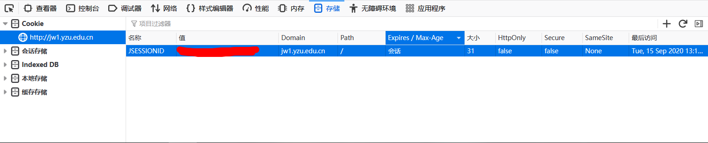
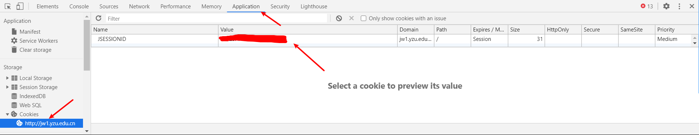

# 抢课助手使用教程  

**注意：本程序还处于demo阶段，还有很多功能未实现，介意勿用**  

本程序是用于YZU的公选课抢课，理论上适用所有使用URP综合教务系统（未经测试）

## Usage

#### 0.下载程序
- 编译好的exe在`dist`文件夹内，或者直接 [点我下载](https://github.com/luoboQuQ/YZU-ke/raw/master/dist/qiang.exe)

#### 1.获得Cookie
- 登录教务系统，按下`F12`打开控制台，选择`储存`选项，然后在`Cookie`选项里即可看到（这里使用的是火狐浏览器，Chrome系的在`Application`中查看）

**注意：必须是jw1，否则会提示Cookie错误**

#### 2.启动程序，按照提示填入Cookie和课程号即可

## Todo
- [x] 课序号和Cokkie不用修改源码，直接由用户输入
- [x] 结果查询，软件自动停止
- [ ] 编译成exe，免除环境安装
- [ ] 自动获取Cookie
- [ ] 多线程抢课