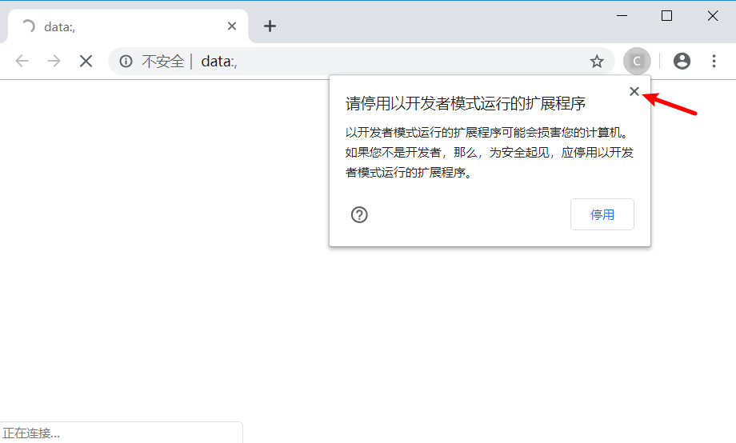
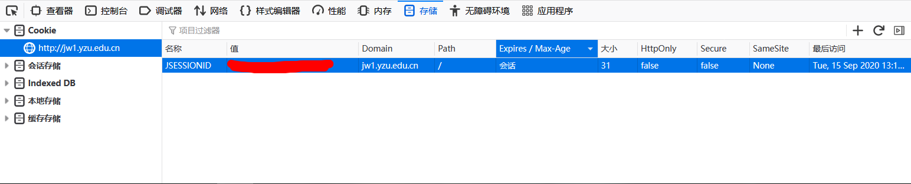
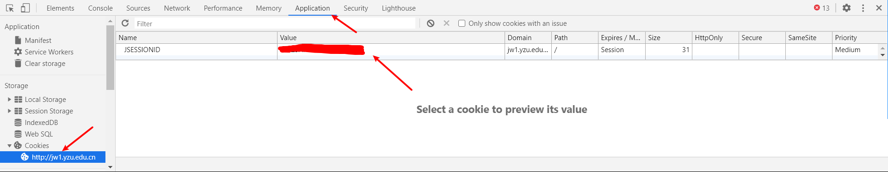

# 选课助手使用教程  

~~注意：本程序还处于demo阶段，可能存在BUG，欢迎提交issue~~ 

**更新：由于学校已经使用新的教务系统，该程序功能已经全部失效，我也不打算制作新的程序，就关闭仓库了。**

本程序是用于YZU的公选课选课，理论上适用所有使用URP综合教务系统（未经测试）

## 📗使用方法

### 🔑快速使用

解压后直接运行ke.exe程序即可

**注意：登陆弹出右侧提示勿点击停用，直接x掉即可**

## 🔐进阶使用
### 🔧更新方法
 下载更新包覆盖原文件即可
### 🔧手动获得Cookie的方法
- 登录教务系统，按下`F12`打开控制台，选择`储存`选项，然后在`Cookie`选项里即可看到（这里使用的是火狐浏览器，Chrome系的在`Application`中查看）

**注意：必须是jw1，否则会提示Cookie错误**

## Todo
- [x] 课序号和Cookie不用修改源码，直接由用户输入
- [x] 结果查询，软件自动停止
- [x] 编译成exe，免除环境安装
- [x] 自动获取Cookie
- [ ] 选课结束后自动下一门
- [ ] 多线程选课

